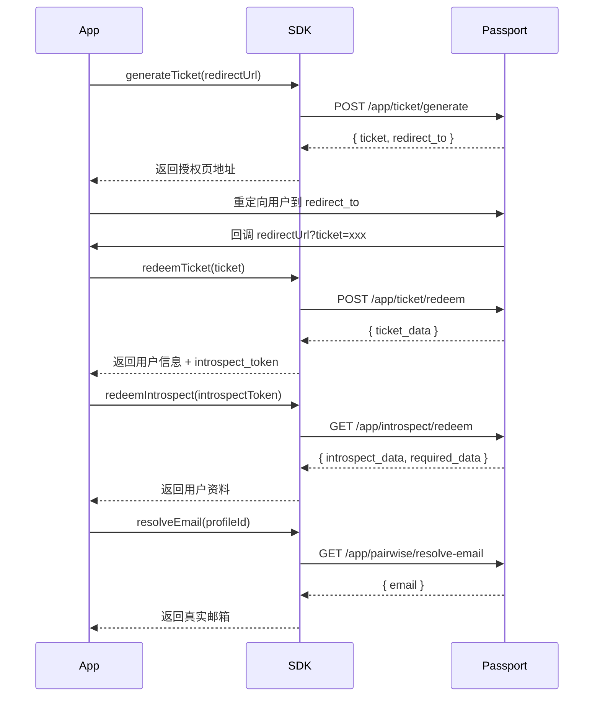

# MIAOMC Passport Node SDK

[](https://www.npmjs.com/package/@miaomc/passport-node-sdk)
[](https://www.npmjs.com/package/@miaomc/passport-node-sdk)

用于 Node.js 的 MIAOMC Passport SDK，提供了与 MIAOMC Passport API 交互的功能，包括请求签名、鉴权和 API 调用。

## 安装

```bash
npm install @miaomc/passport-node-sdk
```

## 快速开始

```typescript
import { MIAOMCPassport } from '@miaomc/passport-node-sdk'

const passport = new MIAOMCPassport({
    appId: 'your-app-id',
    appSecret: 'your-app-secret'
})

// 1. 生成 Ticket，获取授权跳转地址
const { status, data } = await passport.generateTicket('https://your-app.com/callback')
// 请将用户重定向到 data.redirect_to 进行授权
// 授权完成后，Passport 会将用户以 GET 形式，加上 passport-ticket 参数重定向到您填写的 URL 例如：https://your-app.com/callback?passport-ticket=a1b2c3d4e5f....

// 2. 用户授权回调后，用回调中的 ticket 兑换用户信息
const redeemResult = await passport.redeemTicket(ticket)
const { introspect_token, profile_id } = redeemResult.data.ticket_data

// 3. 验证 Introspect Token，获取用户资料
const introspectResult = await passport.redeemIntrospect(introspect_token)
const { profile_name, profile_role } = introspectResult.data.introspect_data

// 4. 通过 Pairwise ID 解析用户真实邮箱
const emailResult = await passport.resolveEmail(profile_id)
console.log(emailResult.data.email)
```

## API 参考

### 初始化

```typescript
import { MIAOMCPassport } from '@miaomc/passport-node-sdk'

const passport = new MIAOMCPassport(config)
```

#### 配置参数

| 参数             | 类型     | 必填 | 说明                                                    |
| ---------------- | -------- | ---- | ------------------------------------------------------- |
| `appId`          | `string` | ✅   | 应用 ID                                                 |
| `appSecret`      | `string` | ✅   | 应用密钥                                                |
| `baseUrl`        | `string` | ❌   | API 基础地址，默认 `https://passport.miaomc.com/api/v1` |
| `advancedConfig` | `object` | ❌   | 高级配置，可自定义请求头名称                            |

<details>
<summary>高级配置示例</summary>

```typescript
const passport = new MIAOMCPassport({
    appId: 'your-app-id',
    appSecret: 'your-app-secret',
    advancedConfig: {
        authorizationHeader: {
            appIdHeader: 'x-miaomc-app-id',
            appNonceHeader: 'x-miaomc-app-nonce',
            appSignatureHeader: 'x-miaomc-signature',
            appSignatureExpiresHeader: 'x-miaomc-signature-expired-at',
            appIntrospectTokenHeader: 'x-miaomc-introspect'
        }
    }
})
```

</details>

---

### Ticket

#### `generateTicket(redirectUrl)`

生成 App Ticket，返回 ticket 和 Passport 授权页地址。

```typescript
const result = await passport.generateTicket('https://your-app.com/callback')
```

**参数：**

| 参数          | 类型     | 说明                 |
| ------------- | -------- | -------------------- |
| `redirectUrl` | `string` | 授权成功后的回调地址 |

**返回：**

```typescript
{
    status: boolean,
    code: number,
    message: string,
    data: {
        ticket: string,        // 生成的 ticket
        redirect_to: string    // Passport 授权页地址，需将用户重定向到此地址
    }
}
```

#### `redeemTicket(ticket)`

用回调中获取的 ticket 兑换用户信息。

```typescript
const result = await passport.redeemTicket('ticket-from-callback')
```

**参数：**

| 参数     | 类型     | 说明                      |
| -------- | -------- | ------------------------- |
| `ticket` | `string` | 从授权回调中获取的 ticket |

**返回：**

```typescript
{
    status: boolean,
    code: number,
    message: string,
    data: {
        ticket_data: {
            app_id: string,
            user_id?: string,
            profile_id?: string,        // Pairwise ID，用于后续查询
            introspect_token?: string,  // Introspect Token，用于验证用户身份
            redirect_url?: string,
            expire_at: number,
            is_processed: boolean,
            allow_redeem: boolean,
            redeemed_at?: number
        }
    }
}
```

---

### Introspect

#### `redeemIntrospect(introspectToken)`

验证 Introspect Token 的有效性，返回用户资料信息。

```typescript
const result = await passport.redeemIntrospect(introspectToken)
```

**参数：**

| 参数              | 类型     | 说明             |
| ----------------- | -------- | ---------------- |
| `introspectToken` | `string` | Introspect Token |

**返回：**

```typescript
{
    status: boolean,
    code: number,
    message: string,
    data: {
        introspect_data: {
            app_id: string,
            profile_id: string,
            pairwised: boolean,
            profile_name: string,    // 用户名
            profile_role: string,    // 用户角色
            created_at: number,
            expired_at: number,
            is_rotate: boolean,
            rotated_at: number | null,
            need_rotate: boolean     // 是否需要轮换 token
        },
        required_data: Record<string, unknown>
    }
}
```

#### `rotateIntrospect(introspectToken)`

轮换 Introspect Token，旧 token 将在新 token 生成后失效。

```typescript
const result = await passport.rotateIntrospect(introspectToken)
const newToken = result.data.introspect_token
```

**参数：**

| 参数              | 类型     | 说明                    |
| ----------------- | -------- | ----------------------- |
| `introspectToken` | `string` | 当前的 Introspect Token |

**返回：**

```typescript
{
    status: boolean,
    code: number,
    message: string,
    data: {
        introspect_token: string  // 新的 Introspect Token
    }
}
```

---

### Pairwise

#### `resolveEmail(pairwiseId)`

通过 Pairwise ID（即 `profile_id`）解析用户的真实邮箱地址。

```typescript
const result = await passport.resolveEmail(profileId)
console.log(result.data.email)
```

**参数：**

| 参数         | 类型     | 说明                                                       |
| ------------ | -------- | ---------------------------------------------------------- |
| `pairwiseId` | `string` | Pairwise 标识 ID（`redeemIntrospect` 返回的 `profile_id`） |

**返回：**

```typescript
{
    status: boolean,
    code: number,
    message: string,
    data: {
        email: string  // 解析后的真实邮箱地址
    }
}
```

## 授权流程



您需要主动管理 Passport 签发的 Introspect Token，请勿每次都发起 Ticket 生成请求，否则可能被限流拒绝。

当 Introspect Token 需要轮换时会在 `redeemIntrospect` 的返回中提示 `need_rotate: true`，请调用 `rotateIntrospect` 获取新的 Token 后替换旧的 Token。

## 类型导出

SDK 导出了所有 TypeScript 类型，方便在项目中使用：

```typescript
import type {
    MIAOMCPassportConfig,
    PassportApiResponse,
    AppGenerateTicketResponse,
    AppTicketData,
    AppRedeemTicketResponse,
    AppIntrospectData,
    AppIntrospectRedeemResponse,
    AppIntrospectRotateResponse,
    AppPairwiseResolveEmailResponse
} from '@miaomc/passport-node-sdk'
```

## 错误处理

所有 API 方法返回统一的响应格式，建议通过 `status` 字段判断请求是否成功：

```typescript
try {
    const result = await passport.redeemIntrospect(token)
    if (!result.status) {
        console.error(`请求失败: ${result.message} (code: ${result.code})`)
        return
    }
    // 正常处理 result.data
} catch (error) {
    console.error('网络错误或签名异常:', error)
}
```

## 申请方式

当前，MIAOMC Passport 仅对受信任的合作伙伴开放。若您希望使用 MIAOMC Passport，请联系 support@miaomc.cn

若您有权限可直接访问 [MIAOMC Passport 开放平台](https://passport.miaomc.cn/dashboard/open-platform) 注册应用。

MIAOMC Passport 可提供测试环境的访问权限，在上线前请务必在测试环境中进行充分的测试。

## License

MIT
